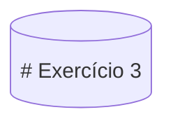
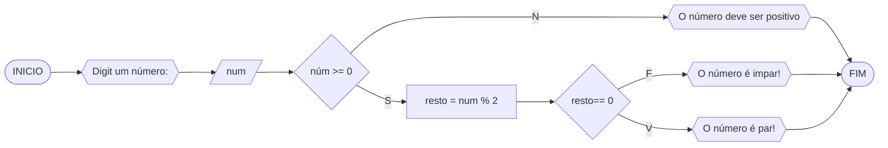

# UNIFOR
**Nome**: Lucca Freire <br>
**disciplina**: Raciocínio lógico algorítmico

## Lista de exercícios 01

## Exercício 3
Represente, em fluxograma e pseudocódigo, um algoritmo para determinar se um número inteiro e positivo é par ou impar.

#### Fluxograma




####**Pseudocódigo**
```
ALGORITMO verifica_par_impar
DECLARE num, resto: INTEIRO
INICIO
ESCREVA "Digite o número:"
LEIA num
SE num >= 0 ENTAO
	resto = num % 2
	SE resto == 0 ENTAO
		ESCREVA "O número é par!"
	SENAO 
		ESCREVA "O númer é impar!"
	FIM_SE
SENAO
	ESCREVA "O número deve ser positivo!"
FIM_SE
FIM
```

####**Teste**
| num | num  >= 0 | resto | resto ==0 | saída |
| -- | -- | -- | -- | -- |
| -1 | False | | | "o numéro deve ser positivo" |
| 0 | True | 0 | True | "O número é par!"|
| 10 | True | 0 | True | "O número é  par!" |
| 11 | True | 1 | False | "O número é impar" |

