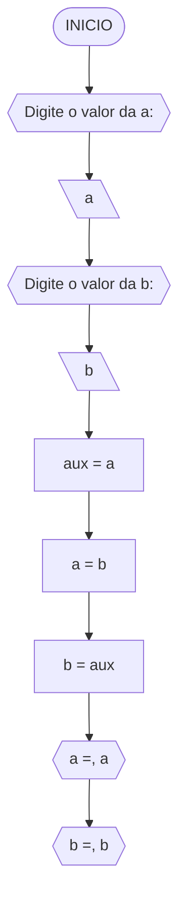
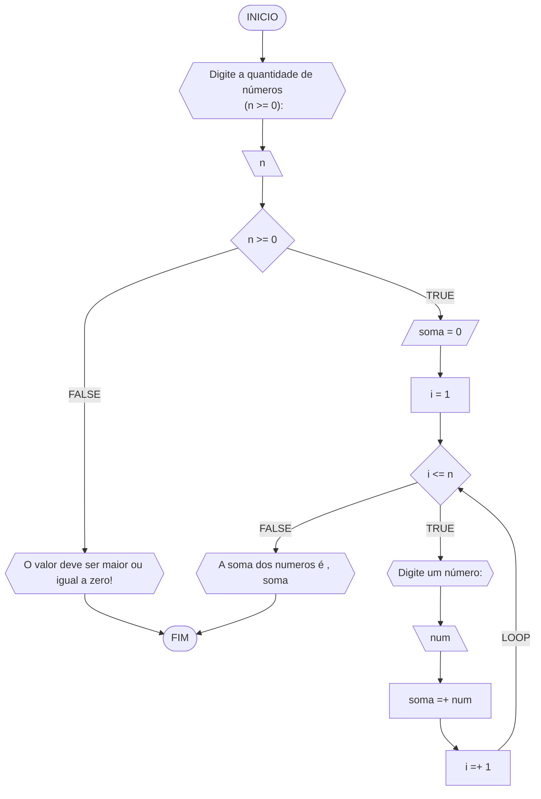
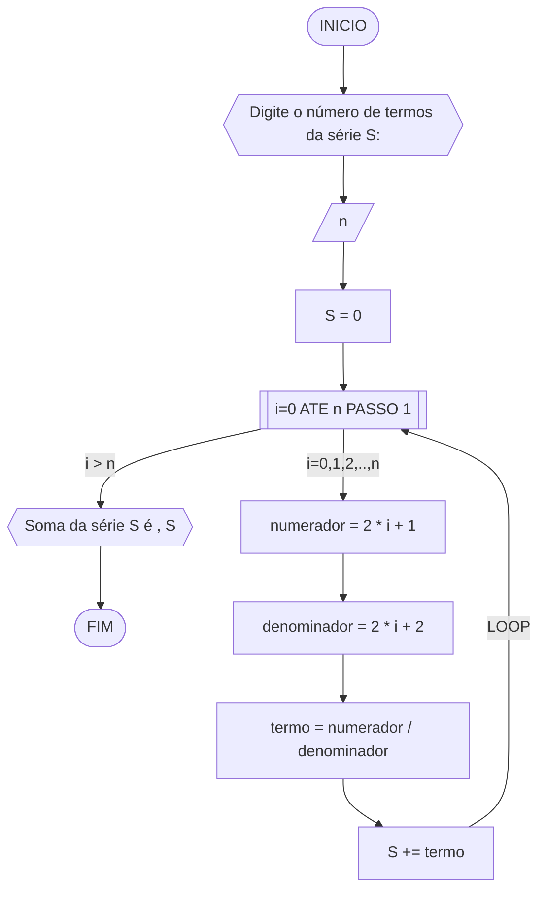
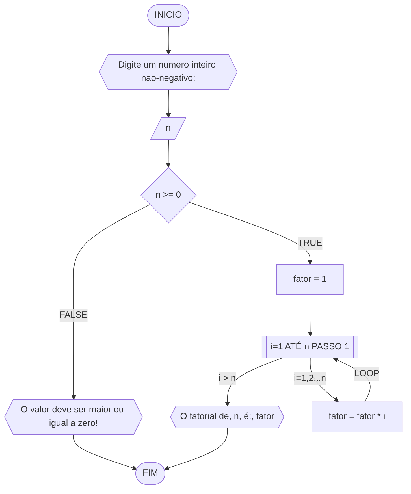
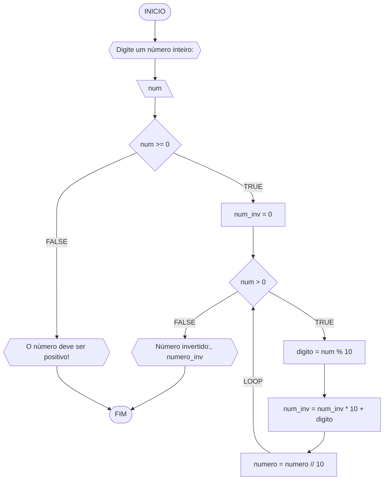

**Curso:** Engenharia da Computação <br>
**Disciplina:** Racicíonio Lógico e Algoritmo <br>
**Código/Turma:** T998-09 <br>
**Professor:** Ricardo Carubbi <br>
**Data:** 21/03 <br>
**Aluno(a):** Lucca Vasconcelos Freire <br>
**Matrícula:** 2410318 <br>

**1a chamada (Sim/Não):** Sim <br>
**2a chamada (Sim/Não):** Não

# Avaliação Diagnóstica 1

## Normas e exigências

Avaliação diagnóstica (**AD**) consiste em exercícios ou projetos desenvolvidos em grupo ao longo da disciplina. <br>
A primeira avaliação diagnóstica (**AD1**) será composta por exercícios e equivale a 30% da nota da primeira avaliação (**AV1**).

Segue abaixo a expressão para o cálculo da **AV1**, sendo sendo **AF1** equivale a primeira avaliação formativa e **AD1**, a primeira avaliação diagnóstica.

$$AV_1 = AF_1 \times 0,30 + AD_1 \times 0,70$$

A **AD1** é formada pela entrega dos exercícios (**EX1**) na data prevista e apresentação (**AP1**) de um dos exercícios escolhido pelo professor.
Segue abaixo a expressão para o cálculo da **AD1**.

$$AD_1 = (EX1_1 + AP_1)/2 $$

A **EX1** é avaliada mediante a **correção dos exercícios**, sendo a avaliação no intervalo de 0% (não atende a questão), 50% (atende parcialmente) e 100% (atende em sua totalidade).
Por exemplo, se o exercício equivale a 2 pontos e sua correção atente parcialmente a questão, então sua avaliação deste exercício será 1 ponto.

A **AP1** é avaliada mediante aos pré-requisitos de **clareza, organização e domínio do conteúdo**. Portanto, o aluno deve demonstrar um bom entendimento do algoritmo, explicando seus princípios fundamentais, seu propósito e como ele funciona passo a passo. <br>

A avaliação da **AP1** é apenas considerada no intervalo de 0% (não atende os pré-requisitos), 50% (atende parcialmente) e 100% (atende em sua totalidade).
Por exemplo, se na apresentação do exercício, o aluno atenter parcialmente os pré-requisitos, então sua avaliação da apresentação será 5,0.

## Datas
- Entrega da primeira avaliação formativa (**AF1**) composta pelas listas de exerciícios 1, 2 e 3: 21/03/24
- Entrega dos exercícios da primeira avaliação diagnóstica (**EX1**): 21/03/24
- Apresentação da primeira avaliação diagnóstica (**AP1**): 21/03/24

## Lista de questões

### Questão 1 - Troca dos valores de duas variáveis (1 ponto)

Dadas duas variáveis, $a$ e $b$, implemente e teste um algoritmo para trocar os valores atribuídos a elas.
#### Fluxograma (0.25 ponto)



#### Pseudocódigo (0.5 ponto)

```
Algoritmo TrocaValores
DECLARE a, b, aux REAL
INICIO
ESCREVA "Digite o valor de a:"
LEIA a
ESCREVA "digite o valor de b"
LEIA b
aux <- a
a <- b
b <- aux
ESCREVA "a =" b
ESCREVA "b=" a
FIM_ALGORITMO
```

#### Teste de mesa (0.25 ponto)

| a  | b  | aux | a  | b  | saída 1 | saída 2 | 
| -- | -- | --  | -- | -- | --      | --      | 
| 0  | 1  | 0   | 1  | 0  | a = 1   | b = 0   |

### Questão 2 - Contagem (1 ponto)

Dado um conjunto $n$ de notas de alunos em um exame, implemente e teste um algoritmo para fazer uma contagem $cont$ do número de alunos que foram aprovados no exame. 
Será considerado aprovado o aluno que tirar $nota$ 50 ou maior (no intervalo de 0 a 100).

#### Fluxograma (0.25 ponto)

```mermaid
flowchart TD
A([INICIO]) --> B{{Digite o número de alunos: }}
B --> C[\n\]
C --> D[\cont = 0\]
D --> E[\i = 1\]
E --> F{i <= n}
F --FALSE--> W{{Número de alunos aprovados: cont}}
W --> Z([FIM])
F --TRUE--> G{{Digite a nota do aluno, i}}
G --> H[\nota\]
H --> I{"nota >= 50 <br>E <br>nota <=100"}
I --TRUE--> J[\cont =+ 1\]
I --FALSE--> K[\i =+ 1\]
J --> K
K --LOO

#### Pseudocódigo (0.5 ponto)

```
Algoritmo ContaAprovacoes
DECLARE n, cont: NUMERICO
i, nota: REAL
INICIO
ESCREVA "Digite o número de alunos:"
LEIA N
cont == 0
ENQUANTO i<=n FAÇA
  ESCREVA: "Digite a nota do aluno" i
  LEIA nota
    SE nota >= 50 E nota <=100 ENTÃO
    cont <- cont + 1
    i <- i + 1
    SENÃO
    i <- +1
FIM_ENQUANTO
LEIA cont
ESCREVA: "Número de alunos aprovados:" cont 
FIM_ALGORITMO
```

#### Teste de mesa (0.25 ponto)

| it | n  | i  | cont | i<=n  | nota, i | nota | nota_valida | cont+1 | i+1 | saída        | 
| -- | -- | -- | --   | --    | --      | --   | --          | --     | --  | --           |
| 1  | 3  | 1  |  0   | True  | nota 1  | 60   | True        | 1      | 2   |              |
| 2  | 3  | 2  |  1   | True  | nota 2  | 40   | False       | 1      | 3   |              |
| 3  | 3  | 3  |  1   | True  | nota 3  | 90   | True        | 2      | 4   |              |
| 4  | 3  | 4  |  2   | False |         |      |             |        |     | Aprovados: 2 |

### Questão 3 - Soma de um conjunto de números (1 ponto)

Dado um conjunto de $n$ números, implemente e teste um algoritmo para calcular a soma desses números. <br>
Aceite apenas $n$ maior ou igual a zero.

#### Fluxograma (0.25 ponto)



#### Pseudocódigo (0.5 ponto)

```
Algoritmo ContaAprovacoes
DECLARE n, i, num: NUMERICO
soma: REAL
INICIO
ESCREVA:"Número de alunos aprovados (n >= 0)"
LEIA n
SE n>=0
  soma == 0
  i == 1
  ENQUANTO i<=n FAÇA
    ESCREVA:"Digite um número:"
    LEIA num
    num + soma <- soma
    i + 1 <- i
  FIM_ENQUANTO
  ESCREVA: "A soma dos numeros é" soma
SENÃO
ESCREVA:"O valor deve ser maior ou igual a zero!"
FIM_ALGORITMO
```

#### Teste de mesa (0.25 ponto)

| it | n  | n >= 0 | soma | i  | i <= n | num | soma =+ num  | saída                   |
| -- | -- | --     | --   | -- | --     | --  | --           | --                      |
|    | -3 | False  |      |    |        |     |              | O valor deve ser ...    |
| 1  | 0  | True   | 0    | 1  | False  |     |              | A soma dos números é 0  |
| 1  | 3  | True   | 0    | 1  | True   | 5   | 0 + 5 = 5    |                         |
| 2  | 3  | True   | 5    | 2  | True   | 10  | 5 + 10 = 15  |                         |
| 3  | 3  | True   | 15   | 3  | True   | 20  | 15 + 20 = 35 |                         |
| 4  | 3  | True   | 35   | 4  | False  |     |              | A soma dos números é 35 |
### Questão 4 - Cálculo de uma série (1 ponto)

Dado um conjunto de $n$ termos da série, implemente e teste um algoritmo para calcular o valor de S, conforme definido abaixo:

$$ S = \frac{1}{2} + \frac{3}{4} + \frac{5}{6} + \frac{7}{8} + \dots $$

#### Fluxograma (0.25 ponto)



#### Pseudocódigo (0.5 ponto)

```
Algoritmo ContaAprovacoes
DECLARE S, n, termo: REAL
i, numerador, denominador: NUMERICO
INICIO
ESCREVA: "Digite o número de termos da série S:"
LEIA   n
0 <-S
REPITA
  numerador = 2 * i + 1
  denominador = 2 * i + 2
  numerador / denominador <- termo
  S + termo <- S
ATE_QUE i > n
ESCREVA: "Soma da série S é , S"   
FIM_ALGORITMO
```

#### Teste de mesa (0.25 ponto)

| it | n  | S  | i | numerador | denominador | termo | S += termo     | saída                  |
| -- | -- | -- |-- | --        | --          | --    | --             | --                     |
|    | 0  | 0  |   |           |             |       |                |                        |
| 1  | 4  | 0  | 0 | 2*0+1 = 1 | 2*0+2 = 2   | 1/2   | 0+1/2 = 1/2    |                        |
| 2  | 4  | 0  | 1 | 2*1+1 = 1 | 2*1+2 = 2   | 3/4   | 1/2+3/4 = 1.25 |                        |
| 3  | 4  | 0  | 2 | 2*2+1 = 1 | 2*2+2 = 2   | 5/6   | 0+1/2 = 2.08   |                        |
| 4  | 4  | 0  | 3 | 2*3+1 = 1 | 2*3+2 = 2   | 7/8   | 0+1/2 = 2.96   | Soma da série S é 2.96 |


### Questão 5 - Cálculo fatorial (2 pontos)

Dado um número $n$, implemente e teste um algoritmo para calcular o fatorial de $n$ (escrito como $n!$), onde $n ≥ 0$.

#### Fluxograma (0.5 ponto)



#### Pseudocódigo (1.0 ponto)

```
Algoritmo ContaAprovacoes
DECLARE n, fatorial: INTEIRO
fator: NUMERICO
INICIO
ESCREVA: "Digite um número inteiro não-negativo"
LEIA N
SE N>=0
  1 <- fator
  REPITA
    fator * i <- fator
    i+1 <- i
  ATE_QUE i > n
  ESCREVA:"O fatorial de, n, é:" fator
SENAO
ESCREVA:"O valor deve ser maior ou igual a zero!"
FIM_ALGORITMO
```

#### Teste de mesa (0.5 ponto)

| n  | fator | i  | fator = fator * i | saída               |
| -- | --    | -- | --                | --                  |
| 3  | 1     | 1  | 1*1 = 1           |                     |
| 3  | 1     | 2  | 1*2 = 2           |                     |
| 3  | 2     | 3  | 2*3 = 6           | O fatorial de 3 é 6 |

### Questão 6 - Geração da sequência de Fibonacci (2 pontos)

Gerar e imprimir os $n$ primeiros termos da sequência de Fibonacci, onde $n ≥ 1$. <br>
Os primeiros termos são: $0, 1, 1, 2, 3, 5, 8, 13, \dots$ <br>
Cada termo, além dos dois primeiros, é derivado da soma dos seus dois antecessores mais próximos.

#### Fluxograma (0.5 ponto)

```mermaid
flowchart TD
A([INICIO]) --> B{{"Número de termos da série Fibonacci:"}}
B --> C[a = 0]
C --> D[b = 1]
D --> E[[i=1 ATÉ n PASSO 1]]
E --"i > n"--> J([FIM])
E --"i=1,2,...,n"--> F{{a}}
F --> G[termo_atual = a + b]
G --> H[a = b]
H --> I[b = termo_atual]
I --LO

#### Pseudocódigo (1.0 ponto)

```
Algoritmo ContaAprovacoes
DECLARE a, b, termo_atual: INTEIRO
i: NUMERICO
INICIO
ESCREVA: "Número de termos da série Fibonacci:"
LEIA N
0 <- a
1 <- b
REPITA
  0 == i
  termo_atual <- a + b
  b <- a
  termo_atual <- b
  i + 1 <- i
ATE_QUE i > n
ESCREVA "Os n primeiros termos da sequência de Fibonacci são": i, i + 1, i + 2,... i + n
FIM_ALGORITMO
```
#### Teste de mesa (0.5 ponto)

| it | n  | a  | b  | i  | saída | termo_atual = a + b | a = b | b = termo_atual |
| -- | -- | -- | -- | -- | --    | --                  | --    | --              |
| 1  | 5  | 0  | 1  | 1  | 0     | 0 + 1 = 1           | 1     | 1               |
| 2  | 5  | 1  | 1  | 2  | 1     | 1 + 1 = 2           | 1     | 2               |
| 3  | 5  | 1  | 2  | 3  | 1     | 1 + 2 = 3           | 2     | 3               |
| 4  | 5  | 2  | 3  | 4  | 2     | 2 + 3 = 5           | 3     | 5               |
| 4  | 5  | 3  | 5  | 5  | 3     | 3 + 5 = 8           | 5     | 8               |

### Questão 7 - Inversão dos dígitos de um número inteiro (2 pontos)

Implemente e teste um algoritmo para inverter a ordem dos dígitos de um número inteiro positivo de dois dígitos.

#### Fluxograma (0.5 ponto)




#### Pseudocódigo (1.0 ponto)

```
Algoritmo ContaAprovacoes
DECLARE num, num_inv, digito INTEIRO
INICIO
ESCREVA: "Digite um número inteiro:"
LEIA num
  SE num >= 0
  0 <- num_inv
  ENQUANTO num >0 FAÇA
    num%10 <- digito
    num_inv*10 + digito <- num_inv
    num//10 <- num
  FIM_ENQUANTO
  ESCREVA: "Número invertido:, numero_inv"
SENAO
ESCREVA: "O número deve ser positivo!"  
FIM_ALGORITMO
```

#### Teste de mesa (0.5 ponto)

| it | num | num_inv | num > 0 | digito | num = num // 10 | num_inv = (num_inv * 10) + digito | Saída                       |
| -- | --  | --      | --     | --      | --              | --                                | --                          |
|    | -1  | 0       | False  |         |                 |                                   | O número deve ser positivo! |
| 1  | 0   | 0       | False  |         |                 |                                   | Número invertido:: 0        |
| 1  | 42  | 0       | True   | 2       | 4               | 2                                 |                             |
| 2  | 4   | 2       | True   | 4       | 0               | 24                                |                             |
| 3  | 0   | 24      | False  |         |                 |                                   | Número invertido:: 24       |
