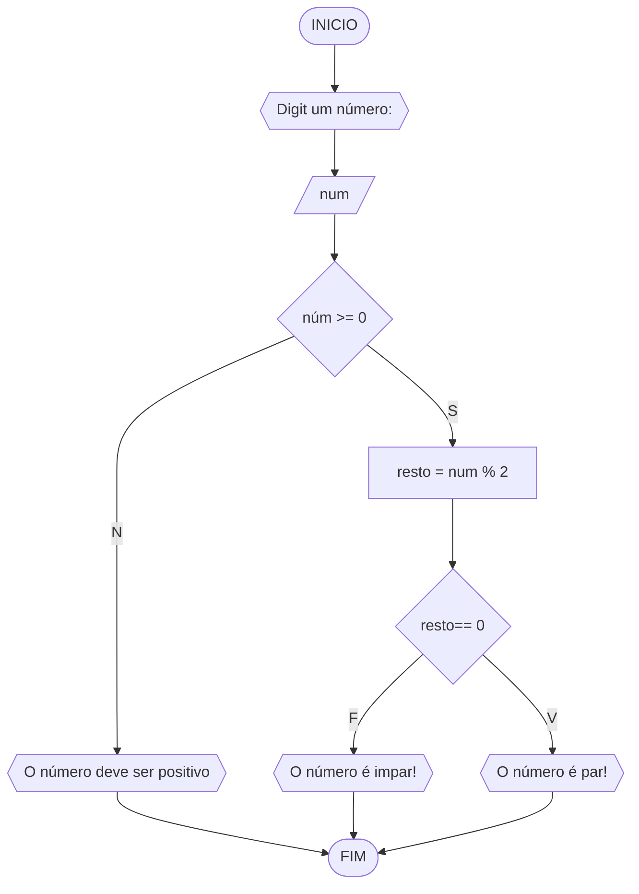

# UNIFOR
**Nome**: Lucca Freire <br>
**disciplina**: Raciocínio lógico algorítmico

## Lista de exercícios 01

#### Fluxograma



#### **Pseudocódigo**
```
ALGORITMO verifica_par_impar
DECLARE num, resto: INTEIRO
INICIO
ESCREVA "Digite o número:"
LEIA num
SE num >= 0 ENTAO
	resto = num % 2
	SE resto == 0 ENTAO
		ESCREVA "O número é par!"
	SENAO 
		ESCREVA "O númer é impar!"
	FIM_SE
SENAO
	ESCREVA "O número deve ser positivo!"
FIM_SE
FIM
```

####**Teste**
| num | num  >= 0 | resto | resto ==0 | saída |
| -- | -- | -- | -- | -- |
| -1 | False | | | "o numéro deve ser positivo" |
| 0 | True | 0 | True | "O número é par!"|
| 10 | True | 0 | True | "O número é  par!" |
| 11 | True | 1 | False | "O número é impar" |

## Exercício 02 (3 pontos)
Represente, em fluxograma e pseudocódigo, um algoritmo para calcular o novo salário de um funcionário. 
Sabe-se que os funcionários que recebem atualmente salário de até R$ 500 terão aumento de 20%; os demais terão aumento de 10%.

#### Fluxograma (1.0 ponto)

```mermaid
flowchart TD
A([INICIO]) --> B{{digite seu salario:}}
B --> C[/N/]
C --> D{N > 500}
D-TRUE-> E[N + N*0.1 ->Sm]
E--> F[/Sm/]
F--> I([FIM])
D-FALSE-> G[N + N*0.2 ->Sm]
G--> H[/Sm/]
H--> I([FIM])

```

#### Pseudocódigo (1.0 ponto)

```
Algoritmo ContaAprovacoes
DECLARE N, Sm NUMERICO
INICIO
ESCREVA "digite seu salario"
LEIA N
SE N > 500
	N + N*0.1 -> Sm
	LEIA Sm
	ESCREVA "Você recebeu um aumento de 10%"
	SENAO
	N + N*0.2 -> Sm
	LEIA Sm
	ESCREVA	"Você recebeu um aumento de 20%"	
FIM_ALGORITMO
```

#### Teste de mesa (1.0 ponto)

| N | Aumento | Final | 
|      --      |      --      |      --      | 
|  600   | 60   |  660  |
| 230  |  46     | 276       | 

**## Exercício 03 (3 pontos)
Represente, em fluxograma e pseudocódigo, um algoritmo para calcular a média aritmética entre duas notas de um aluno e mostrar sua situação, que pode ser aprovado ou reprovado.

#### Fluxograma (1 ponto)

```mermaid
flowchart TD
A([INICIO]) --> B{{Digite duas notas entre 0 e 10:}}
B --> C[/N1/]
C --> D[/N2/]
D --> E{0 <= N <= 10}
E -TRUE-> F{(N1*N2)/2 < M}
TRUE--> G{{Aluno reprovado}}
F-FALSE-> H{{Aluno aprovado}}
E-FALSE-> I{{Digite um número positivo entre 0 e 10.}}
G --> J([FINAL])
H --> J([FINAL])
I --> J([FINAL])
```

#### Pseudocódigo (1 ponto)

```
Algoritmo ContaAprovacoes
DECLARE N1, N2, M NUMERICO
INICIO
ESCREVA "Digite duas notas entre 0 e 10:"
LEIA N1
LEIA N2
SE 0 <= N <= 10
	SE (N1*N2)/2 < M
	ESCREVA "Aluno reprovado"
	SENAO
	ESCREVA "Aluno aprovado"
SENAO
ESCREVA "Digite um número positivo entre 0 e 10."
FIM_ALGORITMO

```**

#### Teste de mesa (1 ponto)

| -- | N1 | N2 | M | APROVADO | 
|      --      |      --      |      --      |   
| T1  | 5      | 5   |  6   | NAO    |
| T2  | 7       | 8   | 7 | SIM |
| T3 | 9        | 3       | 5 | SIM |

## Exercício 04 (3 pontos)
Represente, em fluxograma e pseudocódigo, um algoritmo que, a partir da idade do candidato(a), determinar se pode ou não tirar a CNH. 
Caso não atender a restrição de idade, calcular quantos anos faltam para o candidato estar apto.

#### Fluxograma (1.0 ponto)

```mermaid
flowchart TD
A([INICIO]) --> B {{Digite sua idade}}
B--> C[/N/]
C--> D{N >= 18}
D -TRUE-> E{{O candidato pode tirar CNH}}
D -FALSE-> F[18 - N = N1]
F --> G[/N1/]
G--> H{{O candidato não pode tirar CNH e faltam" N1 anos para tirar}}
H --> J([FIM])
I --> J([FIM])
```

#### Pseudocódigo (1.0 ponto)

```
Algoritmo ContaAprovacoes
DECLARE N, N1 NUMERICO
INICIO
ESCREVA "Digite sua idade"
LEIA N
SE N >= 18
	ESCREVA "O candidato pode tirar CNH"
SENAO
	18 - N -> N1
	LEIA N1
	ESCREVA "O candidato não pode tirar CNH e faltam" N1 anos para tirar"
FIM_ALGORITMO
```

| -- | N | N1 | PODE TIRAR? |
|      --      |      --      |      --      |        --      |     
| T1  | 19      | --  |  SIM   |  
| T2  | 15       | 3  | NAO | 
| T3 | 9        | 9    | NAO |


site para executar: https://stackedit.io/app#
