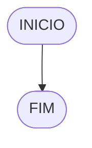

# UNIFOR
**Nome**: Lucca Freire <br>
**disciplina**: Raciocínio lógico algorítmico

## Lista de exercícios 01

#### Fluxograma


#### **Pseudocódigo**
```
ALGORITMO verifica_par_impar
DECLARE num, resto: INTEIRO
INICIO
ESCREVA "Digite o número:"
LEIA num
SE num >= 0 ENTAO
	resto = num % 2
	SE resto == 0 ENTAO
		ESCREVA "O número é par!"
	SENAO 
		ESCREVA "O númer é impar!"
	FIM_SE
SENAO
	ESCREVA "O número deve ser positivo!"
FIM_SE
FIM
```

####**Teste**
| num | num  >= 0 | resto | resto ==0 | saída |
| -- | -- | -- | -- | -- |
| -1 | False | | | "o numéro deve ser positivo" |
| 0 | True | 0 | True | "O número é par!"|
| 10 | True | 0 | True | "O número é  par!" |
| 11 | True | 1 | False | "O número é impar" |

## Exercício 02 (3 pontos)
Represente, em fluxograma e pseudocódigo, um algoritmo para calcular o novo salário de um funcionário. 
Sabe-se que os funcionários que recebem atualmente salário de até R$ 500 terão aumento de 20%; os demais terão aumento de 10%.

#### Fluxograma (1.0 ponto)



#### Pseudocódigo (1.0 ponto)

```
Algoritmo ContaAprovacoes
FIM_ALGORITMO
```

#### Teste de mesa (1.0 ponto)

| nome_coluna1 | nome_coluna2 | nome_coluna3 | nome_coluna4 | nome_coluna5 | 
|      --      |      --      |      --      |      --      |      --      | 
| Adicione     | espaço       | se quiser    |  alinhar     | as barras    |
| verticais,   | mas          | não é        | obrigatório. | Entendido ?  |

**## Exercício 03 (3 pontos)
Represente, em fluxograma e pseudocódigo, um algoritmo para calcular a média aritmética entre duas notas de um aluno e mostrar sua situação, que pode ser aprovado ou reprovado.

#### Fluxograma (1 ponto)


#### Pseudocódigo (1 ponto)

```
Algoritmo ContaAprovacoes
FIM_ALGORITMO
```**

#### Teste de mesa (1 ponto)

| nome_coluna1 | nome_coluna2 | nome_coluna3 | nome_coluna4 | nome_coluna5 | 
|      --      |      --      |      --      |      --      |      --      | 
| Adicione     | espaço       | se quiser    |  alinhar     | as barras    |
| verticais,   | mas          | não é        | obrigatório. | Entendido ?  |

## Exercício 04 (3 pontos)
Represente, em fluxograma e pseudocódigo, um algoritmo que, a partir da idade do candidato(a), determinar se pode ou não tirar a CNH. 
Caso não atender a restrição de idade, calcular quantos anos faltam para o candidato estar apto.

#### Fluxograma (1.0 ponto)


#### Pseudocódigo (1.0 ponto)

```
Algoritmo ContaAprovacoes
FIM_ALGORITMO
```


site para executar: https://stackedit.io/app#
