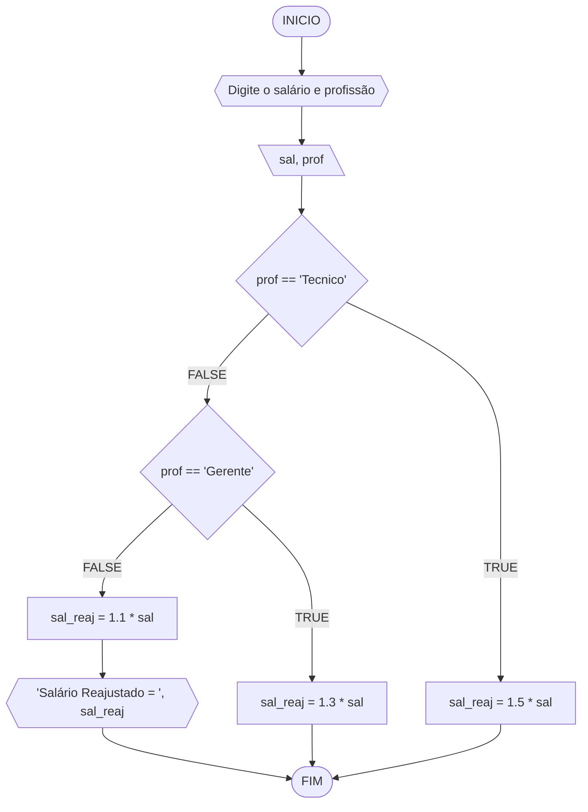
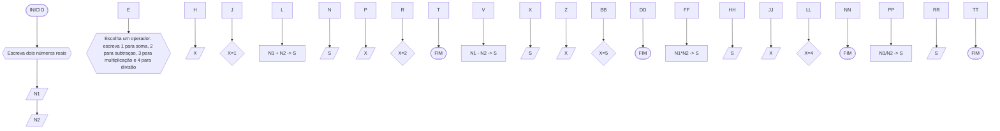
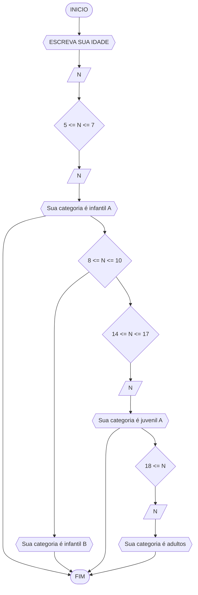

# UNIFOR
**Nome**: Nome do estudante <br>
**Disciplina**: Raciocínio lógico algorítm

## Exercício exemplo
Represente, em fluxograma e pseudocódigo, um algoritmo para calcular o adicional de salário de funcionário por cargo de uma empresa fictícia. Sabe-se que os funcionários de cargo técnico receberão reajuste de 50%, cargo de gerência, um reajuste de 30% e demais, um reajuste de 10%. 

#### Fluxograma


#### Pseudocódigo
```
1  ALGORITMO calReajuste
2  DECLARE  sal, sal_reaj: real, prof: caractere
3  INICIO
4  LEIA sal, prof
5  ESCOLHA
6   CASO prof == “Técnico”		// caso 1
7     sal_reaj ← 1.5 * sal
8   CASO prof = “Gerente”		// caso 2
9     sal_reaj ← 1.3 * sal
10  SENÃO
11    sal_reaj ← 1.1 * sal
12 FIM_ESCOLHA
13 ESCREVA “Salário Reajustado = “, sal_reaj
14 FIM
```

#### Teste
| sal | prof | prof == “Técnico” | prof = “Gerente” | sal_reaj | Saída |
| -- | -- | -- | -- | -- | -- |
| 1000 | Técnico | V | F | 1500 | “Salário Reajustado = 1500“ |
| 2000 | Gerente | F | V | 2600 | “Salário Reajustado = 2600“ |
| 9000 | Diretor | F | F | 9900 | “Salário Reajustado = 9900“ |

## Lista de exercícios 02

### Exercício 01 (2.5 pontos)
Calcule a média de quatro números inteiros dados.

#### Fluxograma (1.0 ponto)

```mermaid
flowchart TD
A([INICIO]) --> B{{digite quatro números inteiros}}
B --> C{ N1 =>0 E N2 =>0  E N3 >=0 E N4 =>0}
C-TRUE-> D[/N1/]
D --> E[/N2/]
E--> F[/N3/]
F--> G [/N4/]
G --> H[(N1 + N2 + N3 + N4)/4 = M]
H--> I[/M/]
I --> J{{A média dos números é M}}
J --> K([FIM])
C-FALSE-> L{{digite nuemros inteiros}}
L --> K([FIM])
```

#### Pseudocódigo (1.0 ponto)

```
Algoritmo Media
DECLARE N1, N2, N3. N4, M REAL
INICIO
LEIA N1, N2, N3, N4
SE 1 =>0 E N2 =>0  E N3 >=0 E N4 =>0
  (N1 + N2 + N3 + N4)/4 = M
  LEIA M
  ESCREVA "A média dos números é " M
SENAO
  ESCREVA "digite numEros inteiros"
FIM_ALGORITMO
```

#### Teste de mesa (0.5 ponto)

| N1 | N2 | N3| N4 | M | 
|      --      |      --      |      --      |      --      |      --      | 
| 5    | 6      | 4    |  9   | 6   |
| 30  | 1000         | 45.7       | 3.1415  | 1078.84  |

### Exercício 02 (2.5 pontos)
Leia uma temperatura dada em Celsius (C) e imprima o equivalente em Fahrenheit (F). (Fórmula de conversão: F = (9/5) * C + 32)

#### Fluxograma (1.0 ponto)

```mermaid
flowchart TD
A([INICIO]) --> B{{Digite o valor em Celsius}}
B--> C[/C/]
C--> D[C = (F - 32)/1.8]
D--> E[/F/]
E--> F{{O valor em farenheit é: F}}
F --> G([FIM])
```

#### Pseudocódigo (1.0 ponto)

```
Algoritmo ConverteCelsiusFarenheit
DECLARE F, C REAL
INICIO
ESCREVA "Digite o valor em Celsius"
LEIA C
C = (F - 32)/1.8
LEIA F
ESCREVA "O valor em farenheit é:" F
FIM_ALGORITMO
```

#### Teste de mesa (0.5 ponto)

| -- | C | F | 
|      --      |      --      |      --      |     
| t1 | 15     | 59    |  
| t2   | 273        | 523        | 

### Exercício 03 (2.5 pontos)
Receba dois números reais e um operador e efetue a operação correspondente com os valores recebidos (operandos). 
O algoritmo deve retornar o resultado da operação selecionada simulando todas as operações de uma calculadora simples.

#### Fluxograma (1.0 ponto)



#### Pseudocódigo (1.0 ponto)

```
Algoritmo Calculadora
DECLARE N1, N2, S REAL
X inteiro
INICIO
ESCREVA "Escreva dois números reais"
LEIA N1
LEIA N2
ESCREVA "Escolha um operador. escreva 1 para soma, 2 para subtraçao, 3 para multiplicação e 4 para divisão"
LEIA X
SE X == 1
  N1 +  N2 -> S
  LEIA S
SENAO
  SE X == 2
    N1 -  N2 -> S
    LEIA S
  SENAO
     SE X == 3
       N1*N2 -> S
       LEIA S
     SENAO
        SE X == 4
        N1/N2 -> S
        LEIA S
FIM_ALGORITMO
```

#### Teste de mesa (0.5 ponto)

| -- | N1 | N2 | X | S | 
|      --      |      --      |      --      |      --      |      --      | 
| T1   | 4    | 7    |  3    | 28  |
| t2   | 64        | 8       | 4 | 8 |

### Exercício 04 (2.5 pontos)
Elaborar um algoritmo que, dada a idade, classifique nas categorias: infantil A (5 - 7 anos), infantil B (8 -10 anos), juvenil A (11 - 13 anos), juvenil B (14 -17 anos) e adulto (maiores que 18 anos).

#### Fluxograma (1.0 ponto)



#### Pseudocódigo (1.0 ponto)

```
Algoritmo ClassificaCategoria
DECLARE N Numerico
INICIO
LEIA N
SE 5 <= N <= 7
  LEIA N
  ESCREVA "Sua categoria é infantil A"
SENAO
    SE 8 <= N <= 10
        LEIA N
        ESCREVA "Sua categoria é infantil B"
    SENAO
       SE 11 <= N <= 13
        LEIA N
        ESCREVA "Sua categoria é juvenil B"
        SENAO
           SE 14 <= N <= 17
             LEIA N
             ESCREVA "Sua categoria é juvenil B"
  '         SENAO
                 SE N >= 18
                   LEIA N
                   ESCREVA "Sua categoria é ADULTO"
FIM_ALGORITMO
```

